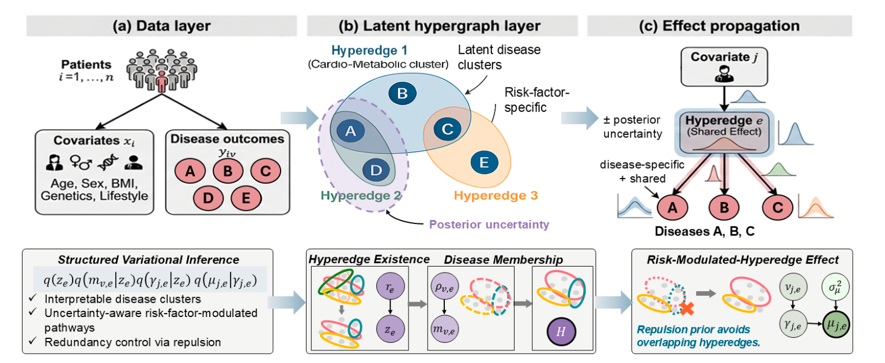
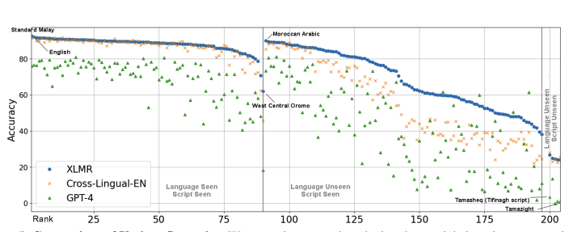
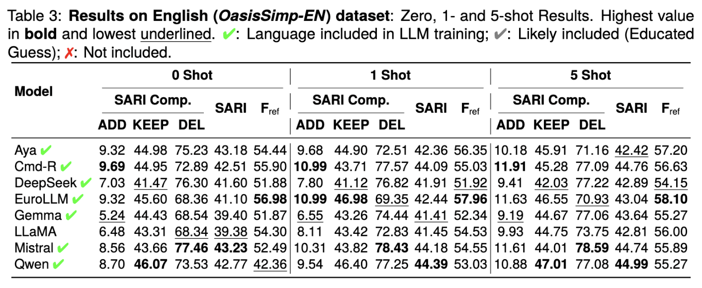
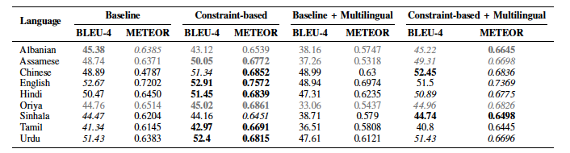
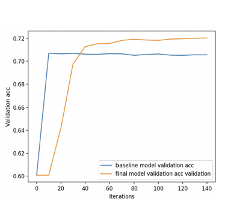
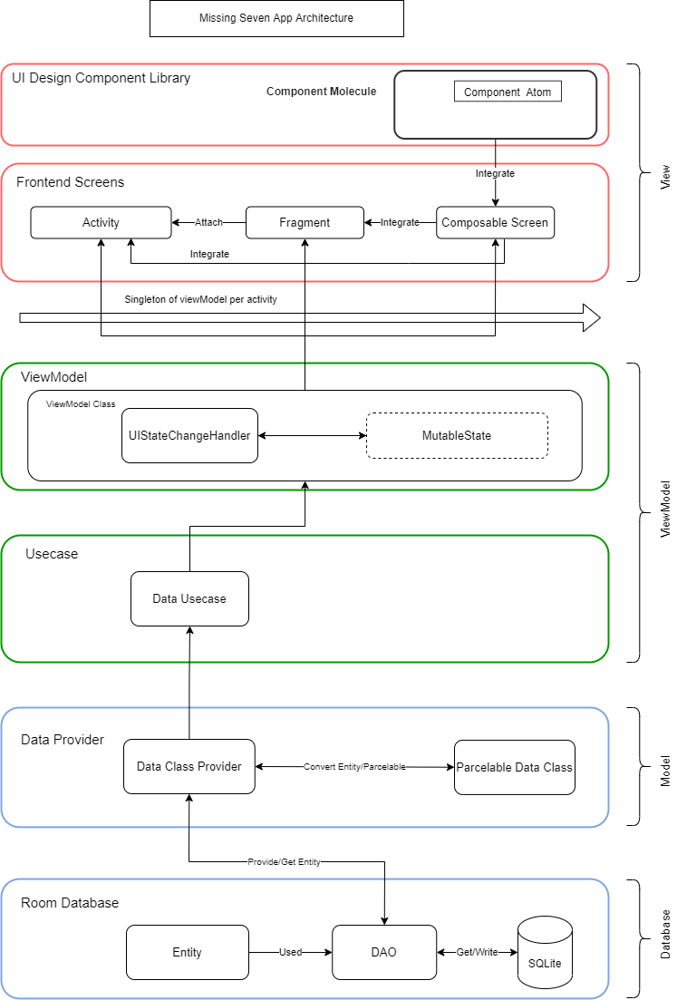
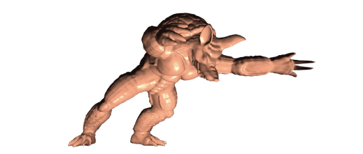

  <article class="research-card featured">
    
    

      Bayesian Modeling
      <h3><a href="../files/18262_Disentangling_Latent_Ris.pdf">Disentangling Latent Risk Pathways via Bayesian Hypergraph Inference</a></h3>
      
ICML 2026 Spotlight paper

      

        Proposes a Bayesian Hypergraph Pathway Inference framework for multi-disease EHR modeling,
        with structured variational inference and a repulsion prior for interpretable, identifiable,
        and uncertainty-aware pathway discovery.
      

    

  </article>

  <article class="research-card">
    
    

      Multilingual NLP
      <h3><a href="https://arxiv.org/abs/2309.07445">SIB-200: A Simple, Inclusive, and Big Evaluation Dataset for Topic Classification in 200+ Languages and Dialects</a></h3>
      
EACL 2024

      

        A large-scale open-source benchmark for topic classification in 200+ languages and dialects,
        designed to improve evaluation quality for multilingual NLU.
      

    

  </article>

  <article class="research-card featured">
    
    

      Multilingual NLP
      <h3><a href="../files/710_Paper.pdf">OasisSimp: An Open-source Asian-English Sentence Simplification Dataset</a></h3>
      
LREC 2026

      

        Introduces a human-annotated simplification dataset across English, Sinhala, Tamil, Thai, and Pashto,
        and benchmarks open-weight multilingual LLMs under zero-shot/few-shot settings to expose
        high-resource vs low-resource performance gaps.
      

    

  </article>

  <article class="research-card">
    
    

      Dataset & Benchmark
      <h3><a href="../files/T-ASL-10245-2023_Proof_hi.pdf">A Multilingual Dataset (MultiMWP) and Benchmark for Math Word Problem Generation</a></h3>
      
IEEE/ACM TASLP, 2023

      

        A multi-way parallel corpus of math word problems in nine languages, including low-resource settings,
        with modeling strategies that integrate mathematical constraints into generation.
      

    

  </article>

  <article class="research-card">
    
    

      Educational Data Mining
      <h3><a href="https://www.atlantis-press.com/proceedings/isemss-22/125981882">A Diagnostic Question Analysis Model based on a Modified Item Response Theory</a></h3>
      
ISEMSS 2022

      

        A refined IRT-style framework with enhanced discrimination modeling and group-wise diagnostics
        to better assess question quality and learner ability.
      

    

  </article>

  <article class="research-card">
    
    

      Applied AI for Social Impact
      <h3><a href="https://github.com/rampageoppa/engineers-without-boarders-canada-t-main">Water For The World (W4TW)</a></h3>
      
Mobile Learning Application

      

        An educational Android app for water conservation and purification awareness,
        combining interactive quizzes and virtual experiments for community learning.
      

    

  </article>

  <article class="research-card">
    
    

      Physics Simulation
      <h3><a href="https://github.com/rampageoppa/An-approch-for-Stable-Neo-Hookean-Flesh-Simulation">An approach for Stable Neo-Hookean Flesh Simulation</a> · <a href="../files/CSC417_Report.pdf">Paper</a></h3>
      
Computational Graphics

      

        A stable hyperelastic simulation method using closed-form spectral analysis and Hessian projection,
        improving robustness under large deformation, inversion, and rotation.
      

    

  </article>

  <article class="research-card compact">
    

      Statistical Learning
      <h3><a href="../files/Penalized Regression without CV.pdf">Penalized Regression without Cross-validation</a></h3>
      

        Explores ridge, LASSO, and elastic-net methods under summary-data settings for
        neurobiological and behavioral analysis without relying on conventional cross-validation.
      

    

  </article>

